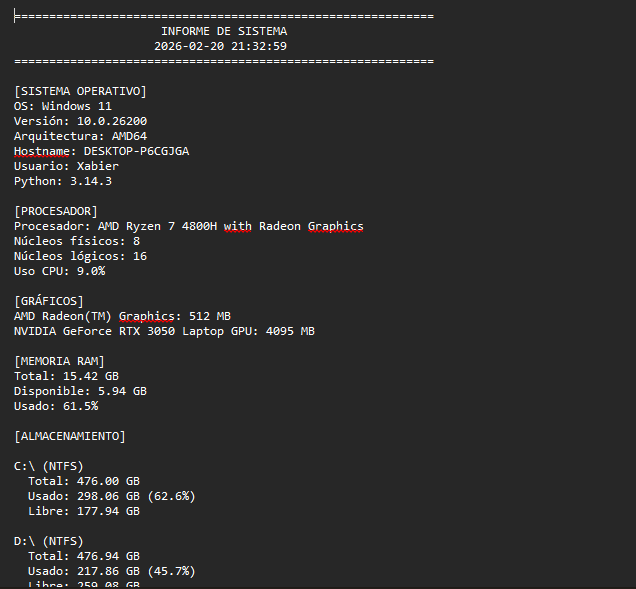

# 🤖 IT Automation Scripts

Colección de scripts Python para automatizar tareas comunes de soporte técnico IT.

## 🎯 Objetivo

Herramientas prácticas que ahorran tiempo en diagnóstico, limpieza y documentación de sistemas.

## 📜 Scripts Disponibles

### 1. 📊 `system_info.py` - Informe Completo del Sistema

Genera un reporte detallado y visual, actualmente 100% funcional en Windows y parcialmente compatible con Linux.
Permite ver el progreso en tiempo real y guarda automáticamente un archivo .txt con todo el informe.

**Uso:**
```bash
python system_info.py
python system_info.py > informe.txt  # Guardar en archivo
```

**Información incluida:**

- Sistema operativo y versión
- CPU: modelo exacto, núcleos, uso
- GPU: todas las tarjetas detectadas + VRAM de cada una
- Memoria RAM y barra visual
- Almacenamiento por partición y barra de uso
- Red: adaptador activo, IP, SSID, velocidad
- Batería (si aplica)
- Placa base: fabricante y modelo
- Tiempo de actividad (uptime)
- Guardado automático del informe en .txt

**Casos de uso:**

- Diagnóstico remoto y documentación rápida de equipos
- Auditoría de hardware y software
- Soporte técnico estructurado y reproducible

---


## EJEMPLO DE SALIDA 



## 📥 Instalación

### Opción 1: Clonar repositorio
```bash
git clone https://github.com/xabierpereira/IT-Automation-Scripts.git
cd IT-Automation-Scripts
pip install -r requirements.txt
```

### Opción 2: Descargar scripts individuales
Descarga solo el script que necesites y ejecuta:
```bash
pip install psutil
python script_info.py
```

---

## 💡 Casos de Uso Reales

### Escenario 1: Cliente reporta "Internet lento"
```bash
1. python system_info.py > cliente_sistema.txt
2. python network_diagnostic.py
   → Identifica: DNS lento
3. Cambiar DNS a 8.8.8.8
```

### Escenario 2: PC muy lento
```bash
1. python system_info.py
   → Verifica: Disco al 100%, RAM al 95%
2. python cleanup_temp.py
   → Libera: 5GB
3. python installed_programs.py
   → Identifica: 50+ programas basura
```

### Escenario 3: Auditoría remota
```bash
# Enviar al cliente por email:
1. system_info.py
2. installed_programs.py

# Cliente ejecuta y envía .txt
# Técnico analiza sin acceso remoto
```

---

## 🎓 Para Técnicos Junior

**Ventajas de usar scripts:**
- ✅ Metodología sistemática
- ✅ No olvidas pasos
- ✅ Resultados documentados
- ✅ Apredes troubleshooting estructurado

**Cómo aprovecharlos:**
1. Ejecuta los scripts para entender qué verifican
2. Lee el código para aprender los comandos
3. Modifica según tus necesidades
4. Comparte con tu equipo

---
**🔜 Próximos Scripts (roadmap)**

🌐 `network_diagnostic.py` - Diagnóstico de red paso a paso

🧹 `cleanup_temp.py` - Limpieza archivos temporales Windows

📋 `installed_programs.py` - Lista programas instalados Windows

🖥️ `wifi_scanner.py` - Escanear redes WiFi cercanas

🔄 ``driver_updater.py`` - Verificar drivers desactualizados

⚡ ``startup_optimizer.py`` - Gestión programas de inicio

💾 ``backup_documents.py`` - Backup automático carpetas importantes

🛡️ ``malware_scanner.py`` - Scan básico de procesos sospechosos

---

## 🤝 Contribuciones

Pull requests bienvenidos. Para cambios mayores, abre un issue primero.

**Ideas para contribuir:**
- Añadir scripts nuevos
- Mejorar scripts existentes
- Traducir a otros idiomas
- Añadir soporte Linux/macOS
- Mejorar documentación

---

## ⚠️ Disclaimer

Estos scripts son herramientas de diagnóstico y limpieza. Usar bajo tu propio riesgo.

**Recomendaciones:**
- Siempre haz backup antes de limpiezas
- Lee el código antes de ejecutar
- Ejecuta en entorno de prueba primero
- No uses en sistemas críticos sin verificar

---

## 📞 Soporte

¿Encontraste un bug? ¿Tienes sugerencias?

- 🐛 Issues: [github.com/xabierpereira/IT-Automation-Scripts/issues](https://github.com/xabierpereira/IT-Automation-Scripts/issues)
- 💬 Discussions: Pestaña Discussions en GitHub
- 📧 Email: xabierpereira40@gmail.com

---

## 👨‍💻 Autor

**Xabier Pereira**  
Técnico IT Junior | IFCT0309  

📧 xabierpereira40@gmail.com  
💼 [LinkedIn](https://linkedin.com/in/xabierpereira)  
💻 [GitHub](https://github.com/xabierpereira)  

---

## 📄 Licencia

MIT License - Ver [LICENSE](LICENSE) para detalles.

Uso libre para aprendizaje, trabajo personal y comercial.

---

## ⭐ Agradecimientos

Si estos scripts te ayudaron, considera:
- ⭐ Dar star al repositorio
- 🔄 Compartir con otros técnicos IT
- 💬 Dejar feedback en Issues/Discussions
- 🤝 Contribuir con mejoras

---


**Última actualización:** 20 Febrero 2026
